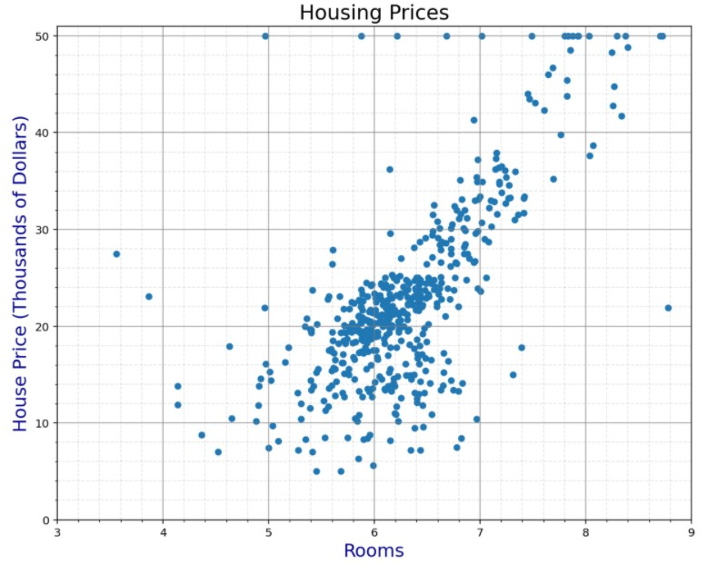
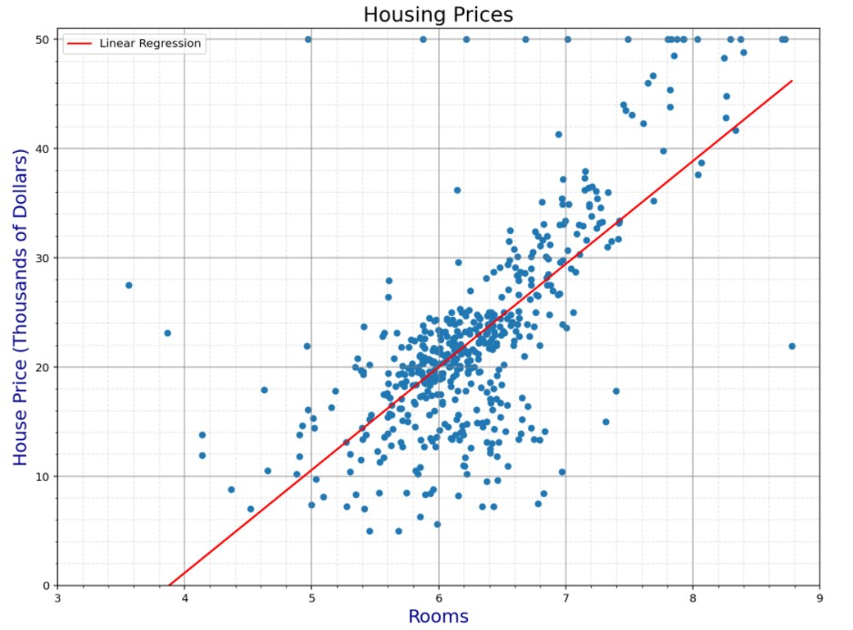
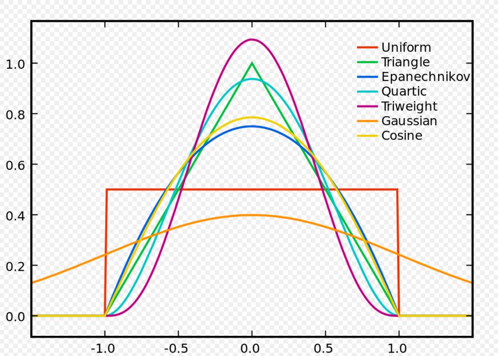
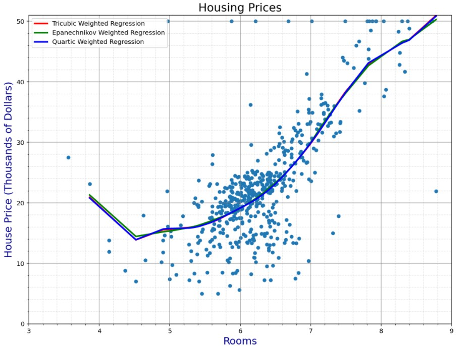
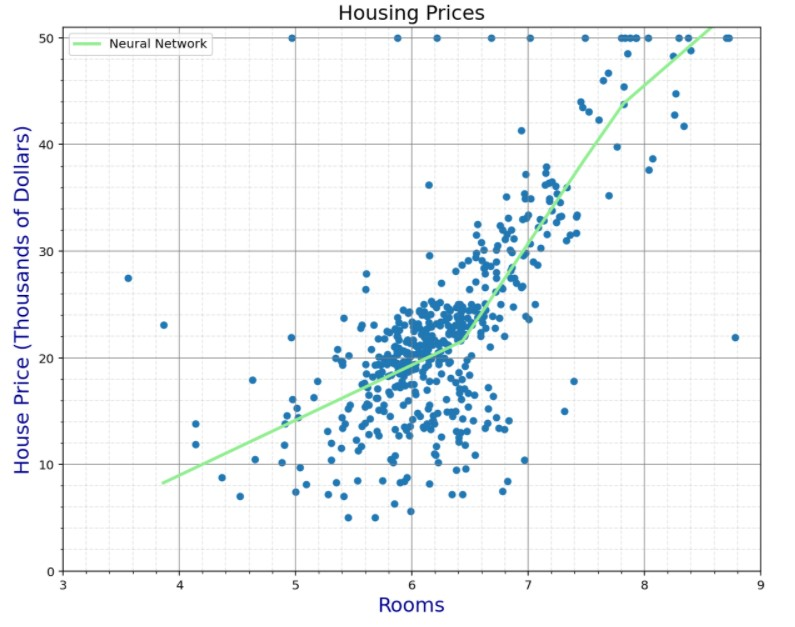

# Boston Housing Analysis 

For this first lab, we are just doing some real quick and easy analyses of a classic dataset to start to come to grips with the tools and techniques of data science. The dataset in question is Boston Housing (which I've found in the course of doing this lab is actually included [directly in scikit!](https://scikit-learn.org/stable/modules/generated/sklearn.datasets.load_boston.html)), a dataset that includes a solid 506 entries and 17 dimensions.

## The Dataset
The purpose of the Boston housing dataset is to predict the price of a given house with the plethora of other information provided, including location, local crime rates, age, tax rate, etc. However, for this analysis we are going to try to predict the price using only one feature variable: the number of rooms. As you can see in this image: 

there is an easily apparent linear correlation between these two variables. However, although the general trend is clear, it is equally apparent that the relationship cannot be expressed as a function, as there are many instances in which one specific number of rooms has multiple different prices. Thus, any model solely using this one feature variable is going to contain some degree of error, and we are going to have to try a couple of different regression models to try and maximize our predictive power.

## The Techniques
We are going to analyze this dataset using five general techniques, each of which will be explored more deeply as we cover them.

### Linear Regression
The first model up on the block is a simple linear regression. Linear regressions are just about as simple as you can go, outputting a predictive line in a form just like we learned about in 3rd grade `y=mx+b`, where the slope and intercept are chosen to best fit the data at hand. Simple doesnt always mean bad though, especially in cases like these where the relationship closely follows a linear trend. 

### Locally Weighted Regression
With this second model, we start to get a little bit more complicated. Locally weighted regressions work similarly to linear regressions, but instead of taking the data as a whole, the model instead only uses training data that are local to the point in question. The degree to which different points are weighted in this case is given using a kernel function, which essentially smooths out the weighting based on the function in question. Though pretty much any function could be used as a kernel, the ones that are going to serve a useful purpose generally take this sort of shape: 
and are sized such that they can capture all the points close enough to be useful while excluding those that would snarl the data. I didn't bother including any kernels outside the ones we defined in class, as all three of those gave nearly identical trend lines and MAEs within $20 of each other, as you can see below. 

### Neural Network
Neural networks provide another layer of complexity into the whole scenario. Though the term is extremely broad and can refer to any number of specific implementations, the specific kind of NN we are using is the Keras Sequential module. Sequential is a pretty simplistic NN implementation, at least from my understanding, and is particularly suitable for instances such as this where we are only using one input variable and one output variable (namely number of rooms and price). We are also using a rectified linear activation function between the layers in order to transform inputs into useful outputs on our nodes. It does so very simply by simply passing along the output if it is positive, and outputting 0 if it is not. However, since the final output is a simple value (the price), our last layer transforms all the previously weighted calculation and outputs it with a linear function to get our final useful value. Although both the theory and the implementation are significantly more complicated than either of the previous methods (and despite how long it took to run), I found that the NN was consistently outperformed by the locally weighted regressions, no matter what sort of arrangement of layers I used. 

### XGBoost
XGBoost is similarly rather complicated, though in my opinion works a little bit more intuitively than a neural network of the type we previously implemented. It essentially works by repeatedly testing splits in the data in order to construct a decision tree that can make localized predictions based on which area of the data your specific point falls into. In that manner it works somewhat similarly to the kernel weighted regressions we performed earlier on. Where it differs from said regressions however, is that what areas are considered "local" and thus considered when making predictions is not statically set out by the user, but instead generated dynamically by the iteration of the decision tree. I confess that I do still find the ways that the parameters interact a little bit opaque; I was able to get the validated MAE down to under $4,140 by reducing the estimators and gamma a tad, but I do not know why that is the case. Shown below is the final decision tree for the version with the best presets I was able to come up with ~
